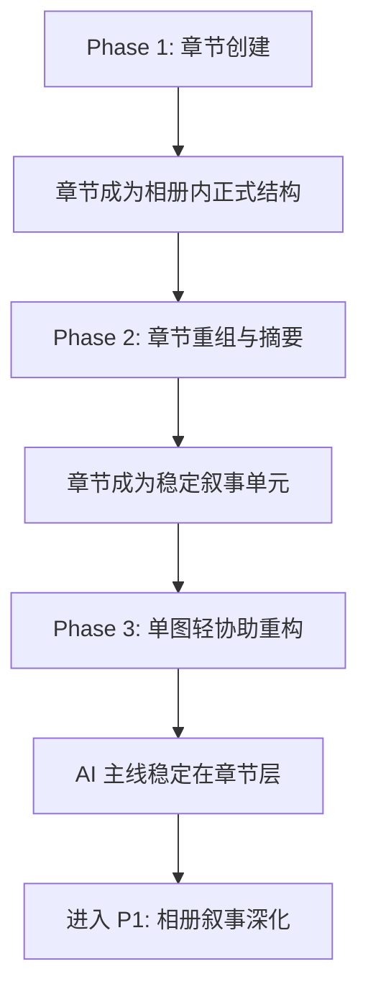

# P0 Execution Roadmap: Chapter-First AI Collaboration

## Current Status

- As of 2026-05-21, the Phase 1 / 2 / 3 code paths described here have been implemented on branch `codex/p0-ai-collaboration`.
- Key landing commits:
  - `0b532a5 feat(album): 添加章节整理与摘要流程`
  - `c5fb083 feat(photo): 增强单张照片辅助与浏览体验`
  - `2ebb909 feat(dashboard): 增加空间整理就绪度卡片`
- The remaining work on this document set is mostly documentation hygiene, follow-up product validation, and deciding what should roll into P1.

> 这份文档用于把 Phase 1 / Phase 2 / Phase 3 串成一条连续执行路线。它不是新的实施计划，而是帮助后续推进时快速判断：当前做到哪一阶段、下一步该做什么、什么情况下应该暂停继续验证。

相关计划：
- [Phase 1: 章节创建与标题建议](/Users/user/Documents/codes/work/docs/superpowers/plans/2026-05-20-p0-chapter-organizing-phase1.md)
- [Phase 2: 章节重组与摘要](/Users/user/Documents/codes/work/docs/superpowers/plans/2026-05-20-p0-chapter-organizing-phase2.md)
- [Phase 3: 单图轻协助与整理准备度](/Users/user/Documents/codes/work/docs/superpowers/plans/2026-05-20-p0-single-photo-assist-phase3.md)
- [P0 主线校正文档](/Users/user/Documents/codes/work/docs/design/2026-05-20-p0-interaction-refocus.md)

---

## 1. 总目标

P0 的核心不是继续强化“单图 AI 面板”，而是把产品主线改成：

`上传照片 -> 用户手动组织章节 -> AI 在章节里协助命名与表达 -> 单图 AI 退到辅助层`

因此，执行路线也应围绕这个目标展开：

1. 先让章节存在
2. 再让章节可整理、可重组
3. 最后再重新安放单图 AI 和 Dashboard

---

## 2. 三阶段关系

### Phase 1

目标：验证“章节是否能成为用户第一次协作整理回忆的起点”。

关键结果：
- 相册页有 `章节区 + 其他瞬间`
- 用户能从未归类照片创建章节
- AI 能给章节标题建议

不解决的问题：
- 章节如何长期维护
- 章节间如何重组
- 无章节单图如何重新定位

### Phase 2

目标：验证“章节是不是稳定可用的回忆组织单元”。

关键结果：
- 章节可编辑、可删除
- 照片可跨章节移动或移回未归类
- 章节可生成摘要

不解决的问题：
- 单图弹窗如何降级重构
- Dashboard 如何承接整理提醒

### Phase 3

目标：验证“章节主线稳定后，单图 AI 是否能退到正确的位置”。

关键结果：
- 无章节单图获得轻协助
- 已归类单图获得章节感知的二级微调
- Dashboard 开始承接整理准备度

不解决的问题：
- 更高级的 AI 风格长期记忆
- 自动章节识别
- P1 相册级故事摘要与里程碑深化

---

## 3. 执行顺序为什么不能颠倒

### 3.1 不能先做 Phase 3

如果章节模型和章节主流程还没站稳，就先重构单图 AI，会产生两个问题：

- 单图仍会被误当成主舞台
- 后续再接章节时，前台心智还得重新推翻一次

所以必须先完成 Phase 1，至少让“章节”作为新主线可见。

### 3.2 不能跳过 Phase 2 直接结束

如果只有“创建章节”，没有“重组章节”，用户会很快遇到两个痛点：

- 整理错了没法调整
- 章节一旦创建就像死结构

这会直接削弱用户对章节层的信任。

### 3.3 Phase 3 必须建立在章节主线稳定之后

单图轻协助的正确定位是：

- 对无章节照片：轻表达
- 对章节内照片：章节感知的二级微调

这个定义只有在章节已经成为主线之后才成立。

---

## 4. 每一阶段的 Go / No-Go 检查点

### Phase 1 Go / No-Go

只有当下面 4 个问题答案基本为“是”，才建议进入 Phase 2：

1. 用户能不能一眼理解“章节”和“其他瞬间”的区别？
2. 用户能不能顺畅地从未归类照片里建一个章节？
3. AI 给的章节标题建议是否至少比空白输入更有帮助？
4. 相册页是否开始从“照片管理”变成“回忆整理”？

如果其中有两个以上答案是否定的，应暂停进入 Phase 2，先回到 Phase 1 继续修正。

### Phase 2 Go / No-Go

只有当下面 4 个问题答案基本为“是”，才建议进入 Phase 3：

1. 用户能否顺畅移动照片、修正章节边界？
2. 章节是否开始像稳定的故事单元，而不是临时分组？
3. 章节摘要是否能明显增强“这是回忆段落”的感觉？
4. 用户是否开始愿意维护章节，而不是只上传不整理？

如果“摘要价值弱”或“重组成本高”仍很明显，应继续留在 Phase 2 打磨。

### Phase 3 Go / No-Go

Phase 3 完成后，需要判断的不是“P0 是否彻底结束”，而是：

1. 单图 AI 是否已经成功退到辅助层，而不再抢主线？
2. Dashboard 的整理提醒是否真的能推动用户继续组织章节？
3. 章节主线是否已经足够稳定，值得继续推进 P1 的相册叙事深化？

如果这三个问题答案基本为“是”，就可以把产品重心切到 P1。

---

## 5. 三阶段的真实依赖图

---

## 6. 每一阶段最该避免的误区

### Phase 1 最该避免

- 过早加太多章节字段
- 过早加复杂拖拽
- 过早重新放大单图 AI 面板

### Phase 2 最该避免

- 把“重组”做成复杂文件管理系统
- 用自动识别章节替代用户手动组织
- 在摘要阶段过度追求文采，忽略结构清晰度

### Phase 3 最该避免

- 让单图 AI 再次占据相册页主流程
- 把 Dashboard 做成抽象统计，而不是整理提醒
- 同时发散到太多 P1 功能

---

## 7. 推荐的实际推进节奏

如果按真实开发节奏推进，我建议这样切：

### Sprint A

只做 Phase 1。

目标：
- 打通章节创建闭环
- 在真实页面里看到“章节在上，其他瞬间在下”

### Sprint B

做 Phase 2。

目标：
- 章节可编辑
- 照片可重组
- 章节摘要出现

### Sprint C

做 Phase 3。

目标：
- 单图协助降级重构
- Dashboard 开始承担整理引导

这样节奏最稳，不会一边改主线一边到处返工。

---

## 8. 完成 P0 后，产品能力会变成什么样

如果三阶段都顺利完成，P0 结束时产品应具备这条完整链路：

1. 用户把照片放进时间段型相册
2. 照片默认先留在“其他瞬间”
3. 用户手动整理出章节
4. AI 帮这段回忆起名字、补摘要
5. 单图在有无章节两种状态下都能得到合适程度的轻协助
6. Dashboard 提醒用户哪些回忆还值得继续整理

这时产品就不再只是“AI 处理照片”，而开始更像“AI 协助共同整理记忆”。

---

## 9. P0 结束后的自然延伸

P0 做完后，最自然进入的不是继续强化单图功能，而是 P1：

- 相册级标题与简介
- 相册内章节之间的关系节奏
- 更可靠的里程碑候选
- 相册级故事摘要

也就是说，P0 的价值不是把所有细节做完，而是把主线从单图转到章节，为 P1 铺路。

---

## 10. 当前建议

如果后续真的开始执行，我建议严格按下面的原则推进：

1. 没完成 Phase 1，不讨论单图 UI 重构
2. 没完成 Phase 2，不判断章节是不是有效结构
3. 没完成 Phase 3，不宣称“AI 已经变成协作对象”

这样可以避免产品和实现再次被局部优化拉偏。
